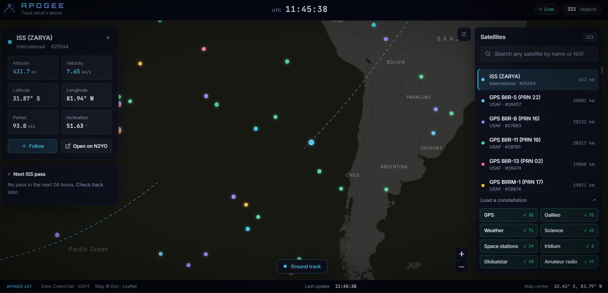
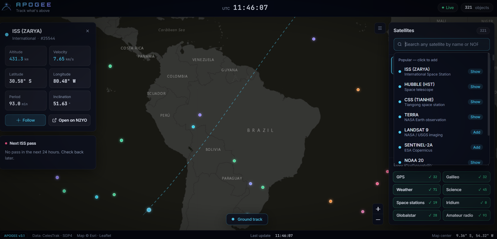
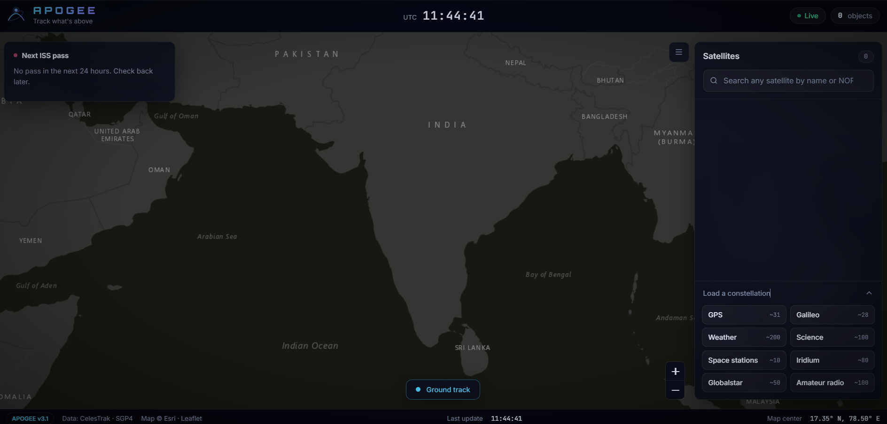

<div align="center">

```text
    ___   ____  ____  ____________________
   /   | / __ \/ __ \/ ____/ ____/ ____/ __ \
  / /| |/ /_/ / / / / / __/ / __/ __/ / / / /
 / ___ / ____/ /_/ / /_/ / /_/ / /___/ /_/ /
/_/  |_/_/    \____/\____/\____/_____/\____/

        T R A C K   W H A T ' S   A B O V E
```

**Mission control for the sky, running entirely in your browser.**

[](https://apogee-jet.vercel.app/)
[](https://celestrak.org)
[](https://github.com/shashwatak/satellite-js)
[](#)

### [🛰️ Launch APOGEE](https://apogee-jet.vercel.app/)

<br>



</div>

---

## 📡 Mission Briefing

```text
┌──────────────────────────────────────────────────────────────┐
│  MISSION     Show what is flying over your head, right now   │
│  STATUS      ● LIVE                                          │
│  OBJECTS     Up to 500 tracked at once                       │
│  CATALOG     Every object CelesTrak publishes                │
│  UPDATE      Every 1 second                                  │
│  BACKEND     None. No server. No keys. No sign-up.           │
└──────────────────────────────────────────────────────────────┘
```

APOGEE is a live satellite tracker. It pulls fresh orbital data from CelesTrak, calculates where every satellite is using the same SGP4 model real tracking stations use, and draws them moving on a dark world map. Click one and you get its altitude, speed, position, orbital period and inclination, updated every second.

---

## 🔭 Features

| | Feature | What it does |
|---|---|---|
| 🔎 | **Full-catalog search** | Type any satellite name or NORAD ID. Results come from CelesTrak's whole catalog, not a short built-in list. |
| ⚡ | **One-click popular picks** | Click the search box to add the ISS, Hubble, Tiangong, Terra, Landsat 9 and more instantly. |
| 🛰️ | **Live telemetry** | Altitude, velocity, latitude, longitude, period and inclination for the selected satellite. |
| 🎯 | **Follow mode** | Lock the map onto a satellite and ride along with it. Drag the map to let go. |
| 〰️ | **Ground track** | See the path the satellite will fly over the next 90 minutes. |
| 🌍 | **Constellations** | Load GPS, Galileo, Weather, Science, Space stations, Iridium, Globalstar or Amateur radio in one click. |
| 👀 | **ISS pass predictor** | Share your location and get a countdown to the next time the ISS passes over you. |
| ⌨️ | **Keyboard shortcuts** | Fast controls for power users (see below). |

---

## 🖼️ Screenshots

<table>
  <tr>
    <td width="50%" align="center">
      <br>
      <b>Search anything</b><br>
      <sub>Type a name or NORAD ID, or click a popular pick.</sub>
    </td>
    <td width="50%" align="center">
      <br>
      <b>Clean launch pad</b><br>
      <sub>Start empty, then load whole constellations in one click.</sub>
    </td>
  </tr>
</table>

---

## 🚀 Quick Start

```bash
# 1. Get the code
git clone https://github.com/yogitha-singh/apogee.git
cd apogee

# 2. Open it. That's the whole install.
#    Double-click index.html, or serve it locally:
npx serve .
```

Needs an internet connection for live data. Nothing to build, nothing to configure.

---

## 🎮 Flight Controls

```text
  /      Focus the search box
  I      Jump to the ISS
  G      Toggle ground track
  Esc    Close the panel or search results
  ↑ ↓    Move through search results
  Enter  Pick the highlighted result
```

---

## 🧠 How It Works

```text
   CelesTrak                satellite.js               Leaflet
 ┌───────────┐  TLE data  ┌─────────────┐  lat/lon  ┌────────────┐
 │ Orbit     │ ─────────▶ │ SGP4 math   │ ────────▶ │ Dark world │
 │ catalog   │            │ (every 1s)  │           │ map + HUD  │
 └───────────┘            └─────────────┘           └────────────┘
```

1. **Fetch.** Orbital elements (TLEs) are requested live from [CelesTrak](https://celestrak.org) when you search or load a constellation.
2. **Propagate.** [satellite.js](https://github.com/shashwatak/satellite-js) runs the SGP4 model to turn those elements into a position for right now.
3. **Draw.** [Leaflet](https://leafletjs.com) plots every satellite on an Esri dark map, and the HUD updates once a second.

---

## 🧰 Tech Stack


No frameworks, no build step, no dependencies to install.

---

## 📁 Project Structure

```text
apogee/
├── index.html     # Layout and markup
├── style.css      # The mission-control look
├── script.js      # Search, tracking, map and pass prediction
├── data.js        # Starter satellites shown at launch
├── live-tracking.png
├── satellite-search.png
├── demo.png
└── README.md
```

---

## 📝 Good to Know

- The few satellites shown at launch come from `data.js` and use sample orbit data, so their positions are approximate. Search for any satellite by name, or load a constellation, to get live, accurate orbits.
- Pass prediction needs location permission, and browsers only allow that over HTTPS, so use the live site rather than opening the file directly.
- Positions are calculated from public orbital data. They're great for exploring, but not for navigation or anything safety-critical.

---

## 🗺️ Roadmap

- [ ] Pass predictions for any satellite, not just the ISS
- [ ] Day and night shadow on the map
- [ ] Shareable links to a specific satellite
- [ ] Orbit path in 3D

Ideas welcome. Open an issue.

---

## 🙏 Credits

- Orbital data: [CelesTrak](https://celestrak.org)
- Orbit math: [satellite.js](https://github.com/shashwatak/satellite-js)
- Maps: [Leaflet](https://leafletjs.com) with tiles from Esri

---

<div align="center">

**Built by [Yogitha Singh](https://github.com/yogitha-singh)**

If you enjoyed looking up, leave a ⭐

*Ad astra.*

</div>
